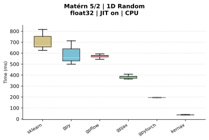

# KernelArena

Benchmarks comparing Gaussian Process kernel implementations across 6 Python libraries — **Kernax**, **scikit-learn**, **GPyTorch**, **GPJax**, **GPFlow**, and **GPy** — on Squared Exponential and Matérn 5/2 kernels.

## Requirements

- [`uv`](https://docs.astral.sh/uv/) — used to create isolated virtual environments per library
- Python 3.10 (for GPy): `uv python install 3.10`

## Quickstart

```bash
git clone https://github.com/SimLej18/KernelArena.git
cd KernelArena
make all DTYPE=float64 GPU=1
```

If you want to run the benchmarks on cpu, remove the GPU option or set it to 0.

This generates input data, runs all 6 libraries, then saves reports and plots under `out/`.

## Example result

Matérn 5/2 — 1D random inputs — float32 — CPU (Apple M4 Max)



## Common configurations

```bash
# Default run — float32, 20 rounds, CPU
make all

# Higher precision
make all DTYPE=float64

# Single library, fewer rounds
make gpjax ROUNDS=5

# Single report or plot for one experiment
make report SCRIPT=test_matern.py TEST=test_1d_random
make plot   SCRIPT=test_matern.py TEST=test_1d_random FORMAT=png
```

## All options

```
make help
```

## Submitting your results

Run the benchmarks, then package the results with:

```bash
make all DTYPE=float64        # or any configuration
make submit DTYPE=float64     # creates results/<cpu>_<dtype>_<date>/
```

Then open a pull request adding your `results/<id>/` folder. The only required file is `run_info.json` (generated automatically) alongside the benchmark JSON files.


